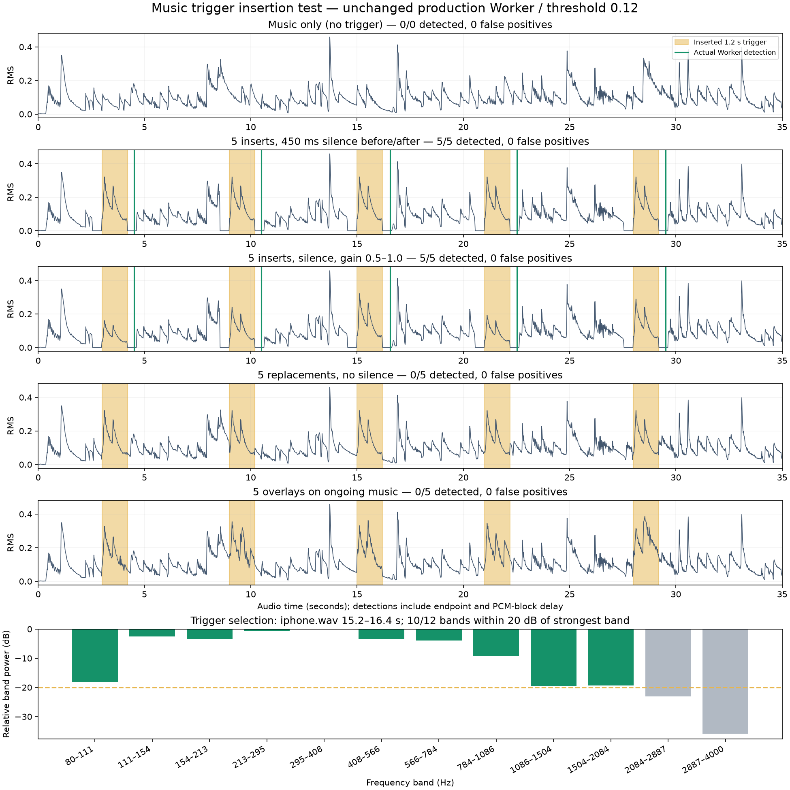

# mic-fr 음악 트리거 삽입 실험

2026-10-01. 실제 앱의 `src/trigger-worker.ts`와 `src/music-trigger.ts`를 수정 없이 TypeScript 컴파일 후 Node VM에서 실행했다. 등록도 Worker의 enroll/finish 경로를 사용했다. PCM은 앱과 같은 4,096샘플 블록으로 공급했다. 검출 결과를 보고 구간이나 임계값을 재선택하지 않았다.

## 음원 구성

- 원본: `/Users/sjchoi/dev/mic-fr/iphone.wav` (원본 미변경).
- 트리거: **15.2–16.4초**, 1.2초. 80–4,000 Hz를 12개 로그 대역으로 나누고, 가장 강한 대역 대비 −20 dB 안에 들어오는 대역 수와 엔트로피로 자동 선정했다. 12개 중 **10개 대역**을 사용한다. 가장 높은 두 대역까지 고르게 사용하는 것은 아니다.
- 삽입 경계 클릭을 줄이기 위해 트리거 양 끝에 10 ms 페이드 적용.
- 배경: 같은 원본에서 트리거 및 주변 구간을 제외한 연주 35초.
- 삽입 시작: **3, 9, 15, 21, 28초**, 각각 1.2초.
- 쉼 조건은 각 삽입 앞뒤 450 ms를 무음으로 교체했다. 음량 변경 조건은 순서대로 0.5/0.75/1.0/0.6/0.9배.
- 무쉼 교체 조건은 기존 연주를 트리거로 교체하고, 겹침 조건은 기존 연주에 트리거를 더했다. 모든 파일의 절대 피크는 1 미만이다.

## 결과

| 조건 | 삽입 | 정상 검출 | 미검출 | 오검출 |
|---|---:|---:|---:|---:|
| Music only (no trigger) | 0 | 0 | 0 | 0 |
| 5 inserts, 450 ms silence before/after | 5 | 5 | 0 | 0 |
| 5 inserts, silence, gain 0.5–1.0 | 5 | 5 | 0 | 0 |
| 5 replacements, no silence | 5 | 0 | 5 | 0 |
| 5 overlays on ongoing music | 5 | 0 | 5 | 0 |

쉼 조건에서 실제 검출 시점은 **4.523, 10.496, 16.555, 22.528, 29.525초**였다. 패턴 종료 기준 지연은 **296–355 ms**이며, 소리 구간 종료 확인 및 PCM 블록 전달을 포함한 오디오 시간 기준 값이다. 오프라인 실행의 벽시계 지연이나 실기기 응답 지연 측정값은 아니다.

## 실패 원인 확인

쉼 없는 교체에서는 파형 자체가 동일하지만 **0/5** 검출했다. 정답 경계를 제공해 따로 비교하면 DTW 거리는 모두 **0.0224**로 임계값 **0.12**보다 작다. 이 진단은 검출 결과에 포함하지 않았다. 즉, 이 조건의 실패는 특징 매칭보다 **쉼에 의존한 후보 구간 분리**에서 발생한다.

겹침 조건도 **0/5** 검출했다. 정답 경계로 계산한 거리는 0.0577/0.0948/0.0628/0.1047/0.1665였다. 구간 분리를 해결해도 마지막 겹침은 현재 임계값을 통과하지 못하므로, 혼합 소리에 대한 특징 매칭 문제도 남는다.

다음 개선 후보는 연속 입력에서 길이를 제한해 탐색하는 subsequence DTW/슬라이딩 윈도이며, 오검출 대조군을 함께 유지해야 한다. 이번 요청에서는 감지기 자체나 임계값을 변경하지 않았다.

## 검증 범위

동일한 녹음 구간을 반복 삽입한 재현성 시험이다. 다른 연주 테이크, 속도 변화, 스피커→실제 마이크 재수음, 방 잔향, 휴대폰 부하에 대한 검증은 아니다. 배경 35초의 오검출 0건을 장시간 오검출률로 일반화할 수 없다. 시작/정지 UI의 재생 중 감지 차단은 우회하고 순수 감지기를 계속 실행해 5회 전부 평가했다.



## 재현

저장소 루트에서 실행한다. Python은 numpy/scipy/soundfile/matplotlib이 설치된 기존 실험 환경을 사용한다.

```sh
experiments/mic-modeling/.venv/bin/python experiments/music-trigger/make_fixture.py
node experiments/music-trigger/evaluate.mjs
MPLCONFIGDIR=/tmp/hifi-trigger-matplotlib experiments/mic-modeling/.venv/bin/python experiments/music-trigger/report.py
```

`output/manifest.json`에 원본 해시·선정 기준·삽입 정답을, `output/results.json`에 실제 감지 코드 해시·검출 결과·정답 경계 진단을 저장한다. `output/detections.csv`로 위치를 확인할 수 있다. WAV와 PCM은 재생성 가능하며 Git에서는 제외한다. 평가 스크립트는 배경 오검출 또는 쉼 조건의 누락/오검출 발생 시 실패 코드로 종료한다. 무쉼 조건은 알려진 한계로 보고한다.
